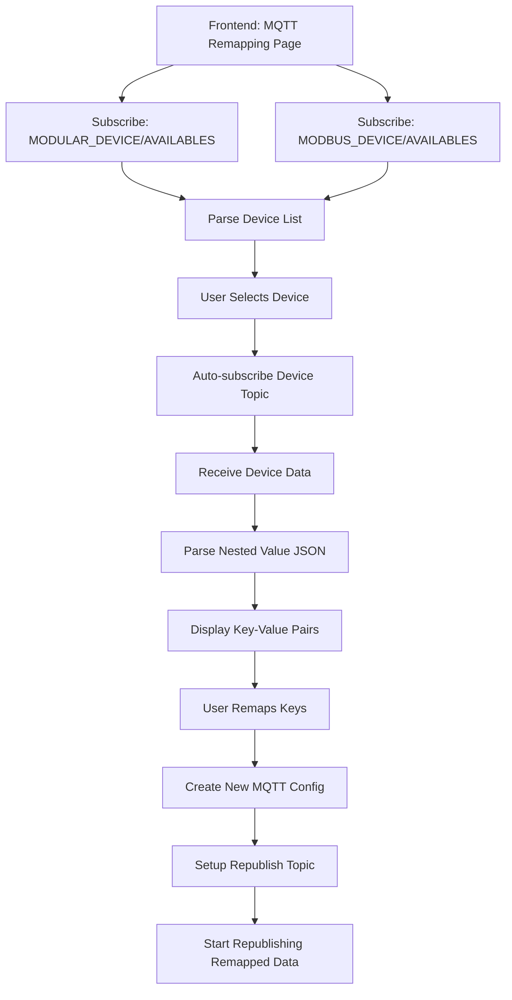

# 🎯 **Fitur Remapping MQTT Payload Data**

## **📋 Overview**

Fitur ini menyediakan kemampuan untuk melakukan remapping (pemetaan ulang) payload data dari topic MQTT yang sudah ada. User dapat memilih device yang tersedia, melakukan remapping key-field data, dan melakukan publish ulang dengan konfigurasi MQTT baru dan topic baru.

## **🎯 Tujuan Utama**

- **Remapping Data**: Transformasi payload data MQTT dengan mengubah key names
- **Konfigurasi MQTT Baru**: Setup ulang parameter MQTT (nama, QoS, LWT, retain, interval)
- **Republish Data**: Publish ulang data yang sudah di-remap ke topic baru
- **Multi-Device Aggregation**: Gabungkan dan sinkronkan data dari beberapa device menjadi satu payload
- **Real-time Processing**: Proses data secara real-time dari berbagai device types

---

## **🔧 Arsitektur Sistem**

### **1. Data Sources**

Fitur ini menggunakan data dari file konfigurasi device yang sudah ter-install:

**Files:**

- `../MODBUS_SNMP/JSON/Config/installed_device.json`
- `../MODULAR_I2C/JSON/Config/installed_devices.json`

**MQTT Topics untuk Discovery:**

- `MODULAR_DEVICE/AVAILABLES` - Device modular I2C
- `MODBUS_DEVICE/AVAILABLES` - Device Modbus/SNMP

### **2. Data Flow Architecture**



---

## **📊 Data Structure & Format**

### **1. Device Discovery Message**

```json
[
  {
    "id": "41060b9f-e3fa-44e6-aef8-319eb070587a",
    "name": "SeedStudio_PH_1",
    "address": "",
    "device_bus": 0,
    "part_number": "S_pH_01",
    "mac": "",
    "manufacturer": "SeedStudio",
    "device_type": "water",
    "topic": "limbah/ph1"
  },
  {
    "id": "4e2f016d-99ad-4220-9229-a8e024851e7a",
    "name": "SeedStudio_PH_2",
    "address": "",
    "device_bus": 0,
    "part_number": "S_pH_01",
    "mac": "",
    "manufacturer": "SeedStudio",
    "device_type": "water",
    "topic": "limbah/ph2"
  }
]
```

### **2. Device Data Message (Raw)**

```json
{
  "device_name": "SeedStudio_PH_2",
  "protocol_type": "MODBUS RTU",
  "comport": "/dev/ttyUSB0",
  "modbus_address": 2,
  "value": "{\"temp\": 28.67, \"ph\": 8.46, \"PollingDuration\": 0.041596412658691406, \"Timestamp\": \"2025-10-01 09:13:04\"}",
  "Timestamp": "2025-10-01 09:13:04"
}
```

### **3. Parsed Value Field (Nestedi JSON)**

```json
{
  "temp": 28.67,
  "ph": 8.46,
  "PollingDuration": 0.041596412658691406,
  "Timestamp": "2025-10-01 09:13:04"
}
```

### **4. Remapped Output Message**

```json
{
  "temp_ph2": 28.67,
  "ph_level_ph2": 8.46,
  "polling_duration_sec": 0.041596412658691406,
  "timestamp_processed": "2025-10-01 09:13:04",
  "original_device": "SeedStudio_PH_2",
  "remapped_at": "2025-10-01 11:15:00"
}
```

### **5. Multi-Device Aggregated Message**

```json
{
  "aggregated_at": "2025-10-01 11:15:30",
  "aggregation_window": "10s",
  "device_count": 3,
  "devices": [
    {
      "device_name": "SeedStudio_PH_2",
      "source_topic": "limbah/ph2",
      "data_received_at": "2025-10-01 11:15:28"
    },
    {
      "device_name": "FlowMeter_M1",
      "source_topic": "water/flow/m1",
      "data_received_at": "2025-10-01 11:15:27"
    },
    {
      "device_name": "Pressure_Transducer_P1",
      "source_topic": "pipeline/pressure/p1",
      "data_received_at": "2025-10-01 11:15:29"
    }
  ],
  "aggregated_data": {
    "water_quality_temp": 28.67,
    "water_quality_ph": 8.46,
    "water_flow_rate": 45.23,
    "pipeline_pressure": 2.14,
    "polling_duration_avg": 0.0389,
    "total_dissolved_solids": 412.5,
    "turbidity": 3.2
  },
  "computed_fields": {
    "flow_velocity": 1.85,
    "pressure_drop": 0.021,
    "water_temperature_fahrenheit": 83.61
  },
  "aggregation_metadata": {
    "merge_strategy": "flat_merge",
    "time_tolerance": "5s",
    "data_quality_score": 98.7,
    "missing_devices": [],
    "total_messages_processed": 45,
    "messages_per_second": 2.25
  }
}
```

---

## **🎮 User Interface Requirements**

### **0. Dynamic Payload Structure Builder**

- **Visual Structure Editor**: Tree-based interface untuk membangun nested structures
- **Path-based Mapping**: Dot-notation paths (ex: `water_quality.sensors.temperature.value`)
- **Structure Templates**: Pre-built templates untuk common data structures (industrial, environmental, IoT)
- **Dynamic Field Types**: Support string, number, boolean, object, array
- **Array Definitions**: Define array structures dengan variable lengths
- **Conditional Structures**: Show/hide fields based on device data conditions
- **Import/Export**: JSON schema import/export untuk structure definitions
- **Real-time Validation**: Live validation untuk structure integrity dan data type compatibility

### **0.1. Multi-Device Selection Interface**

- **Multi-Select Table**: Checkbox selection untuk multiple devices dengan highlight visual
- **Device Categories**: Group devices berdasarkan type (Modbus, Modular, Hybrid)
- **Dependency Graph**: Visual representation relationship antar devices yang akan di-agregate
- **Aggregation Preview**: Live preview bagaimana data akan digabung sebelum save config
- **Time Tolerance Slider**: Adjustable tolerance untuk time synchronization (1-30 seconds)
- **Priority Settings**: Set priority order untuk conflict resolution
- **Aggregation Strategy Selector**: Choose antara Fixed Window, Sliding Window, atau Event-triggered
- **Buffer Status Indicator**: Real-time display memory usage untuk data buffering

### **1. Device Selection Page**

- **Device List Table**: Menampilkan semua device dari MQTT discovery
- **Filter & Search**: Filter berdasarkan device type, manufacturer, status
- **Real-time Status**: Online/offline status setiap device
- **Column Headers**: Name, Type, Topic, Manufacturer, Status, Actions

### **2. Payload Remapping Interface**

- **Data Preview Panel**: Menampilkan raw data yang diterima
- **Key-Value Editor**: Table untuk remapping setiap field
- **Validation**: Validasi format dan duplikasi key names
- **Real-time Preview**: Preview hasil remapping secara real-time

### **3. MQTT Configuration Form**

- **Connection Settings**: Broker URL, client ID, credentials
- **Publication Settings**: QoS level (0/1/2), retain flag, duplicate flag
- **LWT Settings**: Last Will Topic, Message, QoS, Retain
- **Timing Settings**: Publish interval, timeout settings
- **Security Settings**: SSL/TLS, authentication method

### **4. Monitor & Control Panel**

- **Connection Status**: MQTT connection indicator
- **Publication Stats**: Total messages published, error count
- **Live Data View**: Menampilkan latest remapped message
- **Stop/Start Controls**: Pause/resume republishing

---

## **⚙️ Functional Requirements**

### **Core Features**

#### **1. Device Discovery**

```
✅ Subscribe ke MQTT topics discovery
✅ Parse device list dan tampilkan dalam table
✅ Support filtering berdasarkan device type
✅ Real-time status updates (online/offline)
✅ Error handling untuk device discovery failure
✅ Persistence of selected device across sessions
```

#### **2. Data Parsing & Remapping**

```
✅ Auto-subscribe topic berdasarkan device yang dipilih
✅ Parse nested JSON dari field 'value'
✅ Validasi JSON format dan error handling
✅ Dynamic key-value mapping interface
✅ Support multiple data types (string, number, boolean, object)
✅ Validation untuk custom key names (no spaces, special chars)
✅ Save/load remapping templates
```

#### **3. MQTT Republishing**

```
✅ Konfigurasi MQTT baru untuk republish
✅ QoS settings (0, 1, 2)
✅ Retain message flag
✅ Publish interval control (seconds)
✅ LWT (Last Will & Testament) configuration
✅ Connection retry with exponential backoff
✅ Duplicate message detection/filtering
```

#### **4. Monitoring & Analytics**

```
✅ Real-time publication statistics
✅ Error logging dan display
✅ Message throughput monitoring
✅ Connection health checks
✅ Automatic reconnection handling
✅ Performance metrics (latency, success rate)
```

### **Advanced Features**

#### **1. Multi-Device Aggregation**

```
✅ Select multiple devices dari berbagai sources (Modbus + Modular)
✅ Time-based synchronization untuk data merging
✅ Configurable merging strategies (overwrite, array concatenate, custom logic)
✅ Conflict resolution untuk duplicate field names
✅ Tolerance settings untuk time gap antar device
✅ Real-time preview aggregated payload
✅ Trigger-based publishing ketika semua device data tersedia
✅ Support untuk async device data arrival
✅ Memory buffer untuk temporary data storage
✅ Graceful handling untuk waktu timeout device
```

#### **2. Aggregation Strategies**

##### **Time-based Window Merger**

```
✅ Fixed window: Collect semua data dalam window waktu tertentu (ex: 5 seconds)
✅ Sliding window: Continuous aggregation dengan window yang terus bergerak
✅ Event-triggered: Publish ketika semua selected devices telah mengirim data
✅ Priority queue: Higher priority device data akan overwrite lower priority
```

##### **Data Structure Merging**

```
✅ Flat merge: Gabung semua fields menjadi satu object
✅ Nested merging: Group data berdasarkan device categories
✅ Array aggregation: Convert multiple readings into time-series array
✅ Computed fields: Calculate aggregations (avg, min, max) dari multiple sensors
```

#### **3. Template Management**

```
✅ Save remapping configurations sebagai template
✅ Load existing templates untuk device serupa
✅ Share templates across different devices
✅ Version control untuk template changes
✅ Backup dan restore template configurations
```

#### **4. Batch Operations**

```
✅ Select multiple devices for bulk remapping
✅ Apply template ke multiple devices sekaligus
✅ Batch start/stop operations
✅ Group operations untuk device categories
```

#### **5. Dynamic Structure Builder**

```
✅ Visual tree editor untuk nested data structures
✅ Drag-and-drop field positioning
✅ Path-based field mapping dengan dot notation
✅ Support untuk single group hingga sub-sub-group nesting
✅ Object dalam object dan array dalam object
✅ Variable-length arrays dengan dynamic sizing
✅ Conditional fields based on device data conditions
✅ JSON Schema import/export untuk structure definitions
✅ Template system untuk common industry structures
✅ Real-time structure validation dan type checking
✅ Auto-complete untuk field path suggestions
✅ Group operations untuk bulk structure modifications
✅ Duplicate structure detection dan merge suggestions
```

#### **6. Integration Features**

```
✅ Integration dengan existing MQTT configurations
✅ Trigger remapping berdasarkan conditions
✅ Alert system untuk failed mappings
✅ API endpoints untuk external access
```

---

## **🛠️ Technical Implementation (JSON + MQTT Based)**

### **📁 Single Configuration File Structure**

```
middleware/CONFIG_SYSTEM_DEVICE/JSON/
└── remapping_config.json     # SATU FILE untuk semua konfigurasi remapping
```

### **🐍 Backend Python Service (remapping_service.py)**

```python
# Following MQTTConfiguration.py pattern, but single JSON file for all configs

import json
import time
import threading
import logging
import paho.mqtt.client as mqtt
import uuid
from datetime import datetime, timedelta
import os

# --- Global Variables ---
remapping_config = {}  # One big dict containing all configurations
broker_connected = False

# --- Single Configuration File Path ---
remapping_config_file = './JSON/remapping_config.json'

# --- MQTT Topics ---
topic_command = "command_remapping"
topic_response = "response_remapping"

# --- Initialize Single Config File ---
def initialize_remapping_config_file():
    """Initialize the single remapping configuration JSON file with all sections"""
    default_config = {
        "metadata": {
            "version": "1.0.0",
            "created_at": datetime.now().strftime("%Y-%m-%d %H:%M:%S"),
            "updated_at": datetime.now().strftime("%Y-%m-%d %H:%M:%S")
        },
        "active_remappings": [],
        "single_device_mappings": [],
        "multi_device_aggregations": [],
        "structure_templates": [
            {
                "id": "industrial_001",
                "name": "Basic Industrial Sensor",
                "category": "industrial",
                "template": {
                    "device_id": "{device_id}",
                    "sensor_reading": {
                        "value": "{sensor_value}",
                        "unit": "{unit}"
                    },
                    "status": {
                        "online": true,
                        "last_update": "{timestamp}"
                    }
                }
            }
        ]
    }

    if not os.path.exists(remapping_config_file):
        os.makedirs(os.path.dirname(remapping_config_file), exist_ok=True)
        with open(remapping_config_file, 'w', encoding='utf-8') as f:
            json.dump(default_config, f, indent=2)

# --- CRUD Operations untuk Single JSON ---
def load_remapping_config():
    """Load the single configuration file"""
    global remapping_config
    try:
        with open(remapping_config_file, 'r', encoding='utf-8') as f:
            remapping_config = json.load(f)
    except (FileNotFoundError, json.JSONDecodeError):
        initialize_remapping_config_file()

def save_remapping_config():
    """Save changes to the single config file"""
    global remapping_config
    remapping_config['metadata']['updated_at'] = datetime.now().strftime("%Y-%m-%d %H:%M:%S")
    with open(remapping_config_file, 'w', encoding='utf-8') as f:
        json.dump(remapping_config, f, indent=2, ensure_ascii=False)

def create_single_device_mapping(config_data):
    """Create single device mapping in config"""

def create_multi_device_aggregation(config_data):
    """Create multi-device aggregation in config"""

def update_config(config_type, config_id, data):
    """Update any type of configuration"""

def delete_config(config_type, config_id):
    """Delete any type of configuration"""

# --- MQTT Message Handlers ---
def on_message_remapping(client, userdata, msg):
    """Handle all remapping commands via MQTT"""
    message_data = json.loads(msg.payload.decode())
    command = message_data.get('command')

    if command == "get_all_configs":
        handle_get_all_configs(client)
    elif command == "create_single_mapping":
        handle_create_single_mapping(client, message_data)
    elif command == "create_multi_mapping":
        handle_create_multi_mapping(client, message_data)
    elif command == "update_config":
        handle_update_config(client, message_data)
    elif command == "delete_config":
        handle_delete_config(client, message_data)
    elif command == "get_devices":
        handle_get_devices(client)

def handle_get_all_configs(client):
    """Return entire configuration from single JSON file"""
    response = {
        "command": "get_all_configs",
        "success": True,
        "data": remapping_config
    }
    if client and client.is_connected():
        client.publish(topic_response, json.dumps(response))

# --- Main Service ---
def initialize_remapping_service(mqtt_client=None):
    """Initialize with single JSON file"""
    print_startup_banner()

    # Initialize single config file with all sections
    initialize_remapping_config_file()

    # Load entire configuration
    load_remapping_config()

    # Set MQTT client
    global client
    client = mqtt_client

    if client:
        client.subscribe(topic_command, 1)
        client.subscribe("MODULAR_DEVICE/AVAILABLES", 1)
        client.subscribe("MODBUS_DEVICE/AVAILABLES", 1)

    print_success_banner()
    return True
```

### **📊 Single Configuration JSON Schema (remapping_config.json)**

```json
{
  "metadata": {
    "version": "1.0.0",
    "created_at": "2025-10-01 10:00:00",
    "updated_at": "2025-10-01 15:30:00"
  },

  "active_remappings": [
    {
      "id": "active_mapping_001",
      "config_type": "single_device",
      "config_id": 1,
      "status": "running",
      "started_at": "2025-10-01 14:00:00",
      "mqtt_connection": "connected"
    }
  ],

  "single_device_mappings": [
    {
      "id": 1,
      "name": "PH Sensor Remapping",
      "type": "single_device",
      "device_id": "ph_sensor_001",
      "device_topic": "limbah/ph1",
      "device_type": "modular",
      "output_topic": "remapped/ph_sensor_001",
      "key_mappings": {
        "temp": "temperature_celsius",
        "ph": "ph_level",
        "conductivity": "conductivity_microsiemens"
      },
      "mqtt_config": {
        "broker_url": "mqtt://localhost:1883",
        "qos": 1,
        "retain": false,
        "client_id": "remap-ph-sensor-001"
      },
      "status": "enabled",
      "created_at": "2025-10-01 10:00:00",
      "updated_at": "2025-10-01 10:00:00"
    }
  ],

  "multi_device_aggregations": [
    {
      "id": 1,
      "name": "Water Treatment Station",
      "type": "multi_device",
      "description": "Complete water quality monitoring station",

      "devices": [
        {
          "device_id": "ph_sensor_001",
          "device_name": "SeedStudio_PH_2",
          "source_topic": "limbah/ph2",
          "device_type": "modular",
          "priority": 1,
          "key_mappings": {
            "temp": "water_temperature",
            "ph": "water_ph_level"
          }
        },
        {
          "device_id": "flow_meter_001",
          "device_name": "FlowMeter_M1",
          "source_topic": "water/flow/m1",
          "device_type": "modbus",
          "priority": 2,
          "key_mappings": {
            "flow_rate": "water_flow_rate",
            "pressure": "pipeline_pressure"
          }
        }
      ],

      "aggregation_strategy": {
        "type": "fixed_window",
        "window_size": 10,
        "time_tolerance": 5,
        "slide_interval": 0
      },

      "merge_strategy": {
        "type": "flat_merge",
        "conflict_resolution": "priority_wins",
        "group_by_categories": false
      },

      "computed_fields": [
        {
          "field_name": "flow_velocity",
          "calculation": "avg(water_flow_rate)",
          "data_type": "number"
        }
      ],

      "output_structure": {
        "station_id": "WATER_TREATMENT_001",
        "measurement_period": "{current_timestamp}",
        "sensor_data": {
          "quality_parameters": {
            "temperature": "{water_temperature}",
            "ph_level": "{water_ph_level}"
          },
          "flow_parameters": {
            "flow_rate": "{water_flow_rate}",
            "pressure": "{pipeline_pressure}",
            "calculated_velocity": "{flow_velocity}"
          }
        },
        "system_status": {
          "active_devices": "{device_count}",
          "aggregation_health": "nominal"
        }
      },

      "output_topic": "aggregated/water_treatment_station",
      "mqtt_config": {
        "broker_url": "mqtt://localhost:1883",
        "qos": 1,
        "retain": true,
        "client_id": "agg-water-station-001"
      },

      "metadata_settings": {
        "enable_metadata": true,
        "add_timestamps": true,
        "add_data_quality_score": true,
        "add_device_status": true
      },

      "status": "enabled",
      "created_at": "2025-10-01 11:00:00",
      "updated_at": "2025-10-01 11:00:00"
    }
  ],

  "structure_templates": [
    {
      "id": "industrial_sensor_001",
      "name": "Industrial Process Sensor",
      "category": "industrial",
      "description": "Template for industrial process monitoring",
      "template": {
        "device_id": "{device_id}",
        "equipment_name": "{equipment_name}",
        "process_parameters": {
          "pressure": "{pressure_value}",
          "temperature": "{temperature_value}",
          "flow_rate": "{flow_value}"
        },
        "alarm_status": {
          "high_pressure": false,
          "low_temperature": false,
          "flow_deviation": false
        },
        "maintenance_info": {
          "last_service": "{last_service_date}",
          "next_service": "{next_service_date}",
          "health_score": "{health_percentage}"
        },
        "timestamp": "{timestamp}"
      },
      "created_at": "2025-10-01 09:00:00"
    },
    {
      "id": "iot_environmental_001",
      "name": "IoT Environmental Monitoring",
      "category": "environmental",
      "description": "Template for air quality and environmental sensors",
      "template": {
        "sensor_network": "{network_id}",
        "location": {
          "building": "{building_name}",
          "floor": "{floor_number}",
          "zone": "{zone_identifier}"
        },
        "environmental_metrics": {
          "air_quality": {
            "pm2_5": "{pm25_value}",
            "co2_level": "{co2_value}",
            "voc_index": "{voc_value}"
          },
          "climatic_conditions": {
            "temperature": "{temperature}",
            "humidity": "{humidity}",
            "pressure": "{barometric_pressure}"
          }
        },
        "sensor_health": {
          "battery_level": "{battery_percentage}",
          "signal_strength": "{signal_quality}",
          "last_calibration": "{calibration_date}"
        },
        "timestamp": "{timestamp}"
      },
      "created_at": "2025-10-01 09:15:00"
    }
  ]
}
```

### **📡 MQTT Command Structure**

Frontend mengirim command ke **remapping_service.py** melalui MQTT:

```json
// Get Available Devices
{
  "command": "get_devices",
  "request_id": "req_123",
  "timestamp": "2025-01-01 10:00:00"
}

// Create Single Device Mapping
{
  "command": "create_single_mapping",
  "data": {
    "name": "PH Sensor Mapping",
    "device_id": "ph_sensor_001",
    "key_mappings": {
      "temp": "temperature_celsius",
      "ph": "ph_level"
    },
    "output_topic": "remapped/ph1"
  }
}

// Create Multi-Device Aggregation
{
  "command": "create_multi_mapping",
  "data": {
    "name": "Water Quality Station",
    "devices": [...],
    "aggregation_strategy": {...},
    "output_structure": {...}
  }
}
```

### **📨 MQTT Response Structure**

Service memberikan response melalui **response_remapping** topic:

```json
{
  "command": "create_single_mapping",
  "success": true,
  "data": {
    "config_id": 1,
    "message": "Single device mapping created successfully",
    "created_config": {...}
  },
  "request_id": "req_456",
  "timestamp": "2025-01-01 10:00:05"
}
```

---

## **🏗️ Dynamic Structure Builder Examples**

Struktur data tree ini **dihasilkan dari remapping data device** dengan dua cara utama:

### **🔄 Single Device Remapping**

Mengubah **flat data structure** dari satu device menjadi **complex nested structure**:

```json
// INPUT dari device (flat structure)
{
  "device_name": "SeedStudio_PH_2",
  "value": "{\"temp\": 28.67, \"ph\": 8.46, \"conductivity\": 412.5, \"timestamp\": \"2025-10-01T09:13:04Z\"}"
}

// OUTPUT setelah remapping menjadi nested structure
{
  "station_id": "WATER_MONITORING_STATION_001",
  "sensor_data": {
    "primary_parameters": {
      "temperature": 28.67,
      "ph_level": 8.46,
      "conductivity": 412.5
    }
  },
  "timestamp": "2025-10-01T09:13:04Z"
}
```

### **🔗 Multi-Device Aggregation**

**Menggabungkan data dari banyak device** (Modbus, SNMP, Modular) menjadi satu struktur kompleks dengan time synchronization:

```json
// INPUT dari multiple devices:
// Device 1: SeedStudio_PH_2 (Modular) → temp: 28.67, ph: 8.46
// Device 2: FlowMeter_M1 (Modbus) → flow_rate: 45.23
// Device 3: Pressure_Transducer_P1 (SNMP) → pressure: 2.14
// Device 4: TDS_Sensor_T1 (Modular) → tds_value: 412.5

// OUTPUT aggregated menjadi complex tree structure
{
  "facility_name": "WATER_TREATMENT_PLANT_001",
  "monitoring_station": {
    "primary_sensors": {
      "water_quality": {
        "temperature": 28.67,
        "ph_level": 8.46,
        "total_dissolved_solids": 412.5
      },
      "flow_measurements": {
        "main_pipe": {
          "flow_rate": 45.23,
          "pressure": 2.14
        }
      }
    },
    "computed_parameters": {
      "flow_velocity": 1.85,
      "pressure_drop": 0.021
    }
  },
  "metadata": {
    "devices_aggregated": [
      "PH_SENSOR",
      "FLOW_METER",
      "PRESSURE_SENSOR",
      "TDS_SENSOR"
    ],
    "aggregation_timestamp": "2025-10-01T11:15:30Z"
  }
}
```

### **1. Single Group Structure** (Flat JSON)

```json
{
  "device_id": "PH_SENSOR_001",
  "temperature": 28.67,
  "ph_level": 8.46,
  "conductivity": 412.5,
  "timestamp": "2025-10-01T09:13:04Z"
}
```

### **2. Sub Group Structure** (2-Level Nesting)

```json
{
  "device_id": "PH_SENSOR_001",
  "sensor_data": {
    "temperature": 28.67,
    "ph_level": 8.46,
    "conductivity": 412.5
  },
  "metadata": {
    "timestamp": "2025-10-01T09:13:04Z",
    "device_status": "online",
    "battery_level": 87
  }
}
```

### **3. Sub Sub Group Structure** (3-Level Deep Nesting)

```json
{
  "station_id": "WATER_MONITORING_STATION_001",
  "sensors": {
    "water_quality": {
      "primary": {
        "temperature": 28.67,
        "ph_level": 8.46,
        "conductivity": 412.5,
        "dissolved_oxygen": 7.2
      },
      "secondary": {
        "turbidity": 3.2,
        "total_suspended_solids": 12.5,
        "biochemical_oxygen_demand": 2.1
      }
    },
    "flow_measurement": {
      "current": {
        "flow_rate": 45.23,
        "velocity": 1.85,
        "direction": "forward"
      }
    }
  },
  "system_info": {
    "timestamp": "2025-10-01T09:13:04Z",
    "operator": "SYSTEM",
    "version": "2.1.0"
  }
}
```

### **4. Object dalam Object Structure**

```json
{
  "factory_id": "FABRIC_001",
  "production_line": "LINE_A",
  "machine_status": {
    "conveyor_belt": {
      "status": "running",
      "speed": 2.5,
      "direction": "forward",
      "motor_info": {
        "amperage": 12.3,
        "temperature": 45.6,
        "vibration_level": 0.023
      },
      "plc_data": {
        "command_register": 258,
        "status_register": 1,
        "error_code": 0,
        "cycle_count": 14567
      }
    },
    "packaging_machine": {
      "status": "idle",
      "packages_completed": 1234,
      "error_count": 2,
      "maintenance_due": "2025-12-01"
    }
  },
  "environmental_conditions": {
    "temperature": 23.4,
    "humidity": 65.2,
    "dust_level": 12.5,
    "lighting_conditions": {
      "lux_level": 450,
      "color_temperature": 3200
    }
  }
}
```

### **5. Array dalam Object Structure**

```json
{
  "warehouse_id": "WH_001",
  "inventory_snapshot": {
    "timestamp": "2025-10-01T09:13:04Z",
    "total_items": 15240,
    "sections": [
      {
        "section_id": "A1",
        "category": "electronics",
        "items_count": 2850,
        "utilization_percent": 87.5,
        "critical_level": false
      },
      {
        "section_id": "A2",
        "category": "mechanical_parts",
        "items_count": 3420,
        "utilization_percent": 92.1,
        "critical_level": false
      },
      {
        "section_id": "B1",
        "category": "chemicals",
        "items_count": 1890,
        "utilization_percent": 45.2,
        "critical_level": true
      }
    ]
  },
  "recent_transactions": {
    "last_24h": [
      {
        "type": "inbound",
        "quantity": 450,
        "timestamp": "2025-10-01T08:30:00Z"
      },
      {
        "type": "outbound",
        "quantity": 234,
        "timestamp": "2025-10-01T09:12:45Z"
      },
      {
        "type": "inventory_check",
        "discrepancy": -5,
        "timestamp": "2025-10-01T09:00:00Z"
      }
    ]
  }
}
```

### **6. Complex Industrial Structure** (Multi-Level Nesting + Arrays)

```json
{
  "facility_name": "CHEMICAL_PROCESSING_PLANT_001",
  "process_lines": [
    {
      "line_id": "LN_01",
      "process_type": "polymerization",
      "reactors": [
        {
          "reactor_id": "R101",
          "status": "active",
          "operational_data": {
            "temperature": 145.6,
            "pressure": 2.8,
            "ph_level": 7.2,
            "viscosity": 1450,
            "flow_rates": {
              "input_a": 125.0,
              "input_b": 98.5,
              "output": 223.5,
              "recycle": 45.2
            },
            "quality_metrics": {
              "molecular_weight": 250000,
              "density": 1.15,
              "purity_percent": 99.2,
              "contamination_level": 0.008
            },
            "safety_parameters": {
              "oxygen_level": 18.5,
              "explosion_risk": "low",
              "emergency_shutdown_active": false,
              "last_safety_check": "2025-10-01T06:00:00Z"
            }
          },
          "maintenance_schedule": {
            "next_service": "2025-12-15",
            "last_service": "2025-06-15",
            "service_history": [
              { "date": "2025-06-15", "type": "routine", "duration_hours": 8 },
              {
                "date": "2025-03-20",
                "type": "emergency",
                "duration_hours": 12
              }
            ]
          }
        }
      ]
    }
  ],
  "environmental_monitoring": {
    "air_quality": {
      "particulates": { "PM2_5": 15.2, "PM10": 23.8 },
      "gases": { "VOC": 145, "NOx": 1.2, "SO2": 0.8 },
      "ventilation": { "fresh_air_flow": 4500, "exhaust_flow": 4200 }
    },
    "wastewater": {
      "treatment_plants": [
        {
          "plant_id": "WWTP_A",
          "efficiency_percent": 94.5,
          "parameters": {
            "ph_level": 6.8,
            "biological_oxygen_demand": 12,
            "chemical_oxygen_demand": 45,
            "total_suspended_solids": 8,
            "nitrogen_levels": { "ammonia": 0.5, "nitrates": 8.2 },
            "phosphorus": 0.8
          }
        }
      ]
    }
  },
  "system_metadata": {
    "generated_at": "2025-10-01T09:13:04Z",
    "data_quality_score": 98.7,
    "active_processes": 12,
    "system_health": {
      "overall_status": "nominal",
      "warning_count": 2,
      "alert_count": 0,
      "maintenance_mode": false
    }
  }
}
```

### **7. IoT Sensor Network Structure**

```json
{
  "network_id": "SENSOR_NET_001",
  "gateway_info": {
    "location": "Building A - Roof",
    "firmware_version": "3.2.1",
    "uptime_days": 127,
    "last_restart": "2025-09-15T08:00:00Z"
  },
  "sensor_groups": {
    "environmental_sensors": [
      {
        "sensor_id": "TEMP001",
        "type": "temperature",
        "location": "Zone A",
        "current_reading": {
          "value": 23.45,
          "unit": "celsius",
          "quality_indicator": "excellent",
          "timestamp": "2025-10-01T09:13:04Z"
        },
        "calibration": {
          "last_calibrated": "2025-08-01",
          "calibration_due": "2026-08-01",
          "drift_compensation": 0.002
        },
        "alerts": {
          "high_threshold": 30.0,
          "low_threshold": 15.0,
          "current_status": "normal"
        }
      }
    ],
    "security_sensors": [
      {
        "sensor_id": "MOTION001",
        "type": "motion_detector",
        "zone": "Perimeter",
        "status": {
          "motion_detected": false,
          "last_motion": "2025-10-01T07:45:22Z",
          "sensitivity": "medium",
          "battery_level": 78,
          "tamper_detected": false
        },
        "configuration": {
          "delay_time_seconds": 5,
          "night_mode_active": true,
          "suppression_zones": ["Zone 1", "Zone 3"]
        }
      }
    ]
  },
  "network_statistics": {
    "total_sensors": 156,
    "active_sensors": 154,
    "offline_sensors": 2,
    "data_transmission": {
      "packets_sent_last_hour": 12450,
      "packet_loss_percent": 0.2,
      "average_latency_ms": 45,
      "throughput_bps": 2840
    }
  }
}
```

### **8. Path-based Field Mapping Examples**

```typescript
// Path Mapping untuk Complex Structures
const fieldMappings = {
  // Single level
  temp: "sensor.temperature.value",
  ph: "sensor.ph.value",

  // Sub group mapping
  conductivity: "water_quality.primary.conductivity",
  turbidity: "water_quality.secondary.turbidity",

  // Array mapping
  device_1_temp: "sensor_groups.environmental[0].current_reading.value",
  device_2_temp: "sensor_groups.environmental[1].current_reading.value",

  // Complex nested paths
  reactor_pressure: "process_lines[0].reactors[0].operational_data.pressure",
  air_quality_pm25: "environmental_monitoring.air_quality.particulates.PM2_5",

  // Computed field mappings
  avg_temp: "computed.average_temperature",
  system_health_score: "system_metadata.system_health_score",
};
```

## **📋 Example Usage Flow**

### **Scenario: Remapping pH Sensor Data**

1. **Device Discovery**

   - User buka halaman "MQTT Remapping"
   - Frontend subscribe ke `MODULAR_DEVICE/AVAILABLES`
   - Menampilkan list: SeedStudio_PH_1, SeedStudio_PH_2

2. **Device Selection**

   - User pilih "SeedStudio_PH_2"
   - Auto-subscribe ke topic `limbah/ph2`

3. **Data Parsing**

   - Receive message dengan nested JSON
   - Parse field "value" yang berisi: `{"temp": 28.67, "ph": 8.46, ...}`
   - Display key-value pairs ke user

4. **Remapping Configuration**

   - User map "temp" → "temperature_ph2"
   - User map "ph" → "ph_level_ph2"
   - Set MQTT config untuk republish

5. **Start Republishing**
   - Create MQTT connection baru dengan broker
   - Publish ke topic baru seperti `remapped/ph2`
   - Message output: `{"temperature_ph2": 28.67, "ph_level_ph2": 8.46}`

### **Scenario: Multi-Device Water Quality Monitoring**

1. **Device Discovery & Selection**

   - Frontend subscribe ke `MODULAR_DEVICE/AVAILABLES` & `MODBUS_DEVICE/AVAILABLES`
   - Menampilkan devices: pH Sensor, Flow Meter, Pressure Transducer, TDS Meter, Turbidity Sensor
   - User select multiple devices memberikan checkbox:
     - ✅ SeedStudio_PH_2 (Modular I2C)
     - ✅ FlowMeter_M1 (Modbus RTU)
     - ✅ Pressure_Transducer_P1 (Modbus RTU)
     - ✅ TDS_Sensor_T1 (Modular I2C)

2. **Aggregation Configuration**

   - **Strategy**: Fixed Window (10 seconds)
   - **Time Tolerance**: 5 seconds
   - **Merge Strategy**: Flat merge
   - **Conflict Resolution**: Latest timestamp wins

3. **Data Collection (10-second window)**

   ```
   Time: 11:15:27 → FlowMeter_M1 sends: flow_rate: 45.23
   Time: 11:15:28 → PH_Sensor sends: temp: 28.67, ph: 8.46
   Time: 11:15:29 → Pressure_Transducer sends: pressure: 2.14
   Time: 11:15:30 → Window expires → Aggregate & Publish
   ```

4. **Key Remapping Configuration**

   ```
   Original Keys → Remapped Keys
   temp → water_quality_temp
   ph → water_quality_ph
   flow_rate → water_flow_rate
   pressure → pipeline_pressure
   tds_value → total_dissolved_solids
   turbidity → turbidity_ntu
   ```

5. **Aggregated Payload Output**

   ```json
   {
     "aggregated_at": "2025-10-01 11:15:30",
     "aggregation_window": "10s",
     "device_count": 4,
     "aggregated_data": {
       "water_quality_temp": 28.67,
       "water_quality_ph": 8.46,
       "water_flow_rate": 45.23,
       "pipeline_pressure": 2.14,
       "total_dissolved_solids": 412.5,
       "turbidity_ntu": 3.2
     },
     "computed_fields": {
       "flow_velocity": 1.85,
       "pressure_drop": 0.021,
       "water_temperature_fahrenheit": 83.61
     }
   }
   ```

6. **Scenario: Industrial Process Control**

7. **Device Selection**

   - ✅ Temperature_Controller_TC1 (Modbus)
   - ✅ Pressure_Sensor_PS1 (Modbus)
   - ✅ Flow_Controller_FC1 (Modular)
   - ✅ Level_Sensor_LS1 (Modular)
   - ✅ Valve_Position_VP1 (Modbus)

8. **Aggregation Strategy**: Event-triggered

   - Publish hanya ketika semua critical sensors (temp, pressure, level) mengirim data
   - Window: 3 seconds tolerance

9. **Priority Order**

   - 1. Safety sensors (pressure, level)
   - 2. Control parameters (temperature, flow)
   - 3. Position feedback (valve position)

10. **Conflict Resolution Rules**

    ```typescript
    // Jika field "value" duplikat
    if (device.priority === "high") {
      result[fieldName] = deviceData[fieldName];
    } else if (!result.hasOwnProperty(fieldName)) {
      result[fieldName] = deviceData[fieldName];
    }
    ```

11. **Process Control Payload**
    ```json
    {
      "process_id": "BOILER_001",
      "aggregated_at": "2025-10-01 14:22:15",
      "critical_parameters": {
        "boiler_pressure": 1.85,
        "water_level": 2.34,
        "steam_temperature": 145.67
      },
      "control_signals": {
        "feedwater_flow": 12.5,
        "fuel_valve_position": 78.3,
        "air_flow_control": 45.2
      },
      "system_status": {
        "all_sensors_online": true,
        "control_mode": "automatic",
        "safety_interlocks": "active"
      }
    }
    ```

### **Scenario: Environmental Monitoring Station**

1. **Device Categories Mix**

   - **Weather Sensors**: Wind speed, direction, rainfall (Modbus)
   - **Air Quality**: PM2.5, CO2, VOC (Modular I2C)
   - **Noise Level**: Sound pressure level (Modbus)
   - **Radiation**: Geiger counter readings (Modular)

2. **Sliding Window Strategy**

   - Continuous 5-minute windows
   - 1-minute slide interval
   - Rolling averages for environmental data

3. **Data Structure Merging**: Nested merging
   ```json
   {
     "station_id": "ENV_MONITOR_001",
     "measurement_period": "2025-10-01T11:00:00Z/PT5M",
     "weather_conditions": {
       "wind_speed": 12.5,
       "wind_direction": 245,
       "rainfall_accumulated": 2.3
     },
     "air_quality_metrics": {
       "pm2_5_concentration": 15.2,
       "co2_level": 412,
       "voc_index": 145
     },
     "noise_pollution": {
       "average_db": 65.8,
       "peak_db": 89.2
     }
   }
   ```

---

## **🔧 Configuration MQTT Republish**

```typescript
interface RemappingConfig {
  name: string; // Configuration name
  sourceTopic: string; // Topic to subscribe (single device only)
  targetTopic: string; // Topic to publish
  mqttConfig: {
    brokerUrl: string;
    clientId: string;
    qos: 0 | 1 | 2;
    retain: boolean;
    lwt: {
      topic: string;
      message: string;
      qos: 0 | 1 | 2;
      retain: boolean;
    };
    publishInterval: number; // seconds
  };
  keyMapping: Record<string, string>; // {oldKey: newKey}
}

// Untuk multi-device aggregation
interface MultiDeviceAggregationConfig {
  name: string; // Configuration name
  targetTopic: string; // Topic to publish aggregated data
  devices: {
    deviceId: string;
    deviceName: string;
    sourceTopic: string;
    deviceType: "modbus" | "modular";
    priority: number; // For conflict resolution
    keyMappings: Record<string, string>; // Device-specific mappings
  }[];
  aggregationStrategy: {
    type: "fixed_window" | "sliding_window" | "event_triggered";
    windowSize: number; // seconds
    timeTolerance: number; // seconds
    slideInterval?: number; // for sliding window
  };
  mergeStrategy: {
    type: "flat_merge" | "nested_merge" | "array_aggregate";
    conflictResolution:
      | "latest_wins"
      | "priority_wins"
      | "merge_arrays"
      | "custom";
    groupByCategories?: boolean;
  };
  computedFields?: {
    fieldName: string;
    calculation: string; // example: "avg(water_temp, air_temp)"
    dataType: "number" | "boolean" | "string";
  }[];
  mqttConfig: {
    brokerUrl: string;
    clientId: string;
    qos: 0 | 1 | 2;
    retain: boolean;
    lwt: {
      topic: string;
      message: string;
      qos: 0 | 1 | 2;
      retain: boolean;
    };
  };
  metadata: {
    enableMetadata: boolean;
    addTimestamps: boolean;
    addDataQualityScore: boolean;
    addDeviceStatus: boolean;
  };
}
```

---

## **⚠️ Error Handling & Edge Cases**

### **Network Issues**

- MQTT connection failure → Auto retry dengan exponential backoff
- Topic not found → Alert user untuk check device status
- Parser error → Log error dan continue processing
- Invalid JSON → Skip message dengan warning

### **Data Validation**

- Empty value field → Skip processing
- Missing required keys → Default mapping
- Type mismatches → Type coercion atau error
- Malformed JSON → JSON repair atau skip

### **Performance Considerations**

- Large message payloads → Consider pagination/streaming
- High frequency publishing → Rate limiting
- Multiple device subscriptions → Connection pooling
- Memory usage monitoring → Auto cleanup stale connections

---

## **🎯 Success Criteria**

### **Functional**

- ✅ Successfully parse dan remap data dari berbagai device types
- ✅ Reliable MQTT republishing dengan konfigurasi baru
- ✅ Real-time monitoring dan error reporting
- ✅ Template save/load functionality
- ✅ Support untuk bulk operations

### **Technical**

- ✅ <1 second latency untuk data parsing dan republishing
- ✅ 99.9% uptime untuk MQTT connections
- ✅ Zero data loss selama remapping process
- ✅ Scalable untuk 100+ concurrent devices
- ✅ Memory efficient (<100MB untuk processing)

### **User Experience**

- ✅ Intuitive interface untuk key mapping
- ✅ Real-time feedback dan status updates
- ✅ Easy template management
- ✅ Comprehensive error messages
- ✅ Performance monitoring Dashboard

---

## **📋 TASK LIST: IMPLEMENTASI FITUR MQTT PAYLOAD REMAPPING**

### **🎯 PHASE 1: PLANNING & SETUP** (1-2 hari)

#### **1.1 Project Setup & Dependencies**

- [ ] Install required dependencies (MQTT client libraries, JSON schema validators)
- [ ] Setup project structure untuk remapping feature
- [ ] Create configuration files untuk feature flags
- [ ] Update routing untuk new MQTT remapping page
- [ ] Setup environment variables untuk MQTT broker configs

#### **1.2 Backend Architecture Design**

- [ ] Design backend service architecture (middleware/remapping_service.py)
- [ ] Define data models (TypeScript interfaces untuk configs)
- [ ] Design MQTT connection pooling untuk multiple subscriptions
- [ ] Plan data transformation pipeline (parsing → mapping → publishing)
- [ ] Design error handling dan logging strategy

#### **1.3 JSON Configuration Planning**

- [ ] Design JSON configuration file schemas (remapping_config.json, multi_device_config.json, structure_templates.json)
- [ ] Plan JSON validation rules untuk configuration integrity
- [ ] Design audit logging via ErrorLogger integration
- [ ] Design active mapping status tracking via active_remappings.json

### **🎯 PHASE 2: CORE FUNCTIONALITY** (5-7 hari)

#### **2.1 Device Discovery Backend** (Day 3-4)

- [ ] Create DeviceDiscoveryHandler class
- [ ] Implement MQTT subscription untuk MODULAR_DEVICE/AVAILABLES
- [ ] Implement MQTT subscription untuk MODBUS_DEVICE/AVAILABLES
- [ ] Parse device list dari broker messages
- [ ] Cache device information dengan TTL
- [ ] Add device filtering berdasarkan status dan type
- [ ] Update device discovery MQTT message handlers

#### **2.2 Single Device Remapping** (Day 5-6)

- [ ] Create MqttRemappingService class
- [ ] Implement MQTT topic subscription per device
- [ ] Build JSON parser untuk nested value fields
- [ ] Create key mapping logic (simple string transformations)
- [ ] Implement MQTT republisher dengan new config
- [ ] Add connection pooling untuk multiple remapping services
- [ ] Update single device mapping MQTT command handlers

#### **2.3 Data Validation & Error Handling** (Day 7)

- [ ] Implement JSON validation untuk incoming data
- [ ] Add type coercion untuk numbers/strings
- [ ] Create error categorization (network, parsing, mapping errors)
- [ ] Implement retry logic dengan exponential backoff
- [ ] Add connection health monitoring
- [ ] Create error logging system

### **🎯 PHASE 3: ADVANCED FEATURES** (7-10 hari)

#### **3.1 Multi-Device Aggregation Backend** (Day 8-10)

- [ ] Create DeviceAggregationService class
- [ ] Implement time-window synchronization logic
- [ ] Build data merging strategies (flat, nested, array)
- [ ] Implement conflict resolution algorithms
- [ ] Create time tolerance window management
- [ ] Add memory buffers untuk data queuing
- [ ] Implement publish triggers (event-based/time-window)

#### **3.2 Dynamic Structure Builder** (Day 11-14)

- [ ] Create StructureBuilder service untuk tree creation
- [ ] Implement path-based field mapping (dot notation)
- [ ] Build structure validation logic
- [ ] Create template system untuk common structures
- [ ] Implement JSON schema import/export
- [ ] Add drag-drop interface support (data structure planning)
- [ ] Create auto-complete untuk path suggestions

### **🎯 PHASE 4: FRONTEND DEVELOPMENT** (8-12 hari)

#### **4.1 Core UI Components** (Day 15-17)

- [ ] Create remapping main page dengan layout
- [ ] Build DeviceSelector component (table with checkboxes)
- [ ] Create MqttConfigForm component
- [ ] Build KeyValueMapper component dengan table interface
- [ ] Implement real-time data preview panel
- [ ] Create MonitorPanel untuk live statistics

#### **4.2 Multi-Device Interface** (Day 18-20)

- [ ] Build MultiDeviceSelection component dengan category grouping
- [ ] Create aggregation configuration interface (time windows, strategies)
- [ ] Implement dependency graph visualization
- [ ] Build live aggregation preview
- [ ] Add device priority settings UI
- [ ] Create time tolerance sliders

#### **4.3 Structure Builder UI** (Day 21-24)

- [ ] Create tree-based structure editor
- [ ] Implement drag-drop field positioning
- [ ] Build path mapping interface (dot notation input)
- [ ] Create structure templates gallery
- [ ] Add JSON import/export functionality
- [ ] Implement real-time validation feedback
- [ ] Create auto-suggest untuk path completion

### **🎯 PHASE 5: TEMPLATE & CONFIGURATION MANAGEMENT** (4-5 hari)

#### **5.1 Template System** (Day 25-27)

- [ ] Create TemplateStorage backend service
- [ ] Build template CRUD operations
- [ ] Implement template versioning
- [ ] Create template categories (industrial, IoT, environmental)
- [ ] Add template sharing between users/groups
- [ ] Build template validation before saving

#### **5.2 Configuration Persistence** (Day 28-29)

- [ ] Create active mapping configuration storage
- [ ] Implement configuration backup/restore
- [ ] Build mapping status tracking (running/stopped/error)
- [ ] Add configuration versioning
- [ ] Create bulk configuration operations

### **🎯 PHASE 6: INTEGRATION & TESTING** (5-7 hari)

#### **6.1 MQTT Integration Testing** (Day 30-32)

- [ ] Implement all CRUD MQTT command handlers
- [ ] Add authentication/authorization untuk MQTT commands
- [ ] Create MQTT command documentation dengan examples
- [ ] Build MQTT message rate limiting dan security
- [ ] Implement MQTT command versioning
- [ ] Add monitoring dan metrics untuk all MQTT topics

#### **6.2 Comprehensive Testing** (Day 33-36)

- [ ] Unit tests untuk all backend services
- [ ] Integration tests untuk MQTT operations
- [ ] UI tests untuk all components
- [ ] End-to-end tests untuk complete workflows
- [ ] Load testing untuk high-frequency data streams
- [ ] Stress testing untuk 100+ concurrent devices
- [ ] Performance benchmarking terhadap goals

#### **6.3 Documentation & Deployment** (Day 37-38)

- [ ] Create user documentation dengan screenshots
- [ ] Build admin guide untuk configuration
- [ ] Update deployment scripts
- [ ] Create rollback procedures
- [ ] Setup monitoring dan alerting untuk production

### **🎯 PHASE 7: MONITORING & OPTIMIZATION** (3-4 hari)

#### **7.1 Real-time Monitoring** (Day 39-40)

- [ ] Implement real-time statistics dashboard
- [ ] Add performance metrics (latency, throughput, error rates)
- [ ] Create alert system untuk failures
- [ ] Build health checks untuk all services
- [ ] Implement auto-recovery mechanisms

#### **7.2 Performance Optimization** (Day 41-42)

- [ ] Optimize memory usage untuk data buffering
- [ ] Implement connection pooling untuk MQTT
- [ ] Add data compression untuk large payloads
- [ ] Optimize JSON configuration file I/O operations
- [ ] Implement in-memory caching layers untuk config access

### **🎯 PHASE 8: PRODUCTION DEPLOYMENT** (2-3 hari)

#### **8.1 Production Setup** (Day 43-44)

- [ ] Configure production MQTT brokers
- [ ] Setup load balancers jika diperlukan
- [ ] Implement horizontal scaling configurations
- [ ] Setup backup dan disaster recovery
- [ ] Configure monitoring dan logging systems

#### **8.2 Go-Live & Monitoring** (Day 45)

- [ ] Phased rollout dengan feature flags
- [ ] Real-time monitoring selama go-live
- [ ] User training dan documentation
- [ ] Performance monitoring post-deployment
- [ ] Customer feedback collection dan iteration planning

---

## **📊 TASK COMPLEXITY ESTIMATION**

### **🐛 Low Complexity Tasks** (2-4 hours each)

- Basic MQTT connection setup
- Simple component creation
- CRUD API endpoints
- Basic error handling
- UI component styling

### **📈 Medium Complexity Tasks** (8-16 hours each)

- Multi-device aggregation logic
- Structure builder implementation
- Template management system
- Real-time data processing
- Complex UI interactions

### **🔥 High Complexity Tasks** (24-40 hours each)

- Time-window synchronization
- Complex data structure merging
- Performance optimization at scale
- Comprehensive testing automation
- Production deployment orchestration

### **⚡ Critical Path Tasks** (Must be completed first)

1. **Core MQTT infrastructure** - Foundation untuk semua fitur
2. **Device discovery system** - Tanpa ini tidak ada data
3. **Single device remapping** - MVP functionality
4. **Basic UI components** - User needs interface

### **🔄 Parallel Tasks** (Dapat dikerjakan bersamaan)

- Frontend component development
- Template system implementation
- Testing framework setup
- Documentation writing
- Performance monitoring setup

---

## **🎯 SUCCESS MILESTONES**

### **Week 1: Foundation** ✅

- [ ] Project setup completed
- [ ] Core architecture defined
- [ ] Basic MQTT connectivity working

### **Week 2: Single Device MVP** ✅

- [ ] Device discovery functional
- [ ] Single device remapping working
- [ ] Basic UI operational

### **Week 3: Multi-Device Core** ✅

- [ ] Multi-device aggregation working
- [ ] Structure builder functional
- [ ] Template system implemented

### **Week 4: Production Ready** ✅

- [ ] Comprehensive testing passed
- [ ] Documentation completed
- [ ] Performance optimized

### **Week 5: Deployment & Monitoring** ✅

- [ ] Production deployment successful
- [ ] Monitoring systems active
- [ ] User training completed

---

## **🚨 RISK MITIGATION**

### **Technical Risks**

- **MQTT Connection Issues**: Solution - Implement robust connection pooling dan retry logic
- **Memory Leaks**: Solution - Add comprehensive memory monitoring dan cleanup processes
- **Data Loss**: Solution - Implement persistent queues dan transaction logging
- **Performance Bottlenecks**: Solution - Load testing sejak early development

### **Timeline Risks**

- **Scope Creep**: Solution - Strict feature gating dan MVP-first approach
- **Integration Issues**: Solution - Daily integration testing dan continuous integration
- **Team Availability**: Solution - Cross-training dan knowledge sharing sessions
- **Third-party Dependencies**: Solution - Vendor evaluations dan fallback strategies

### **Business Risks**

- **User Adoption**: Solution - Beta testing dengan power users
- **Data Security**: Solution - End-to-end encryption dan access controls
- **Scalability**: Solution - Cloud-native architecture dengan auto-scaling
- **Support Load**: Solution - Comprehensive documentation dan self-service features
