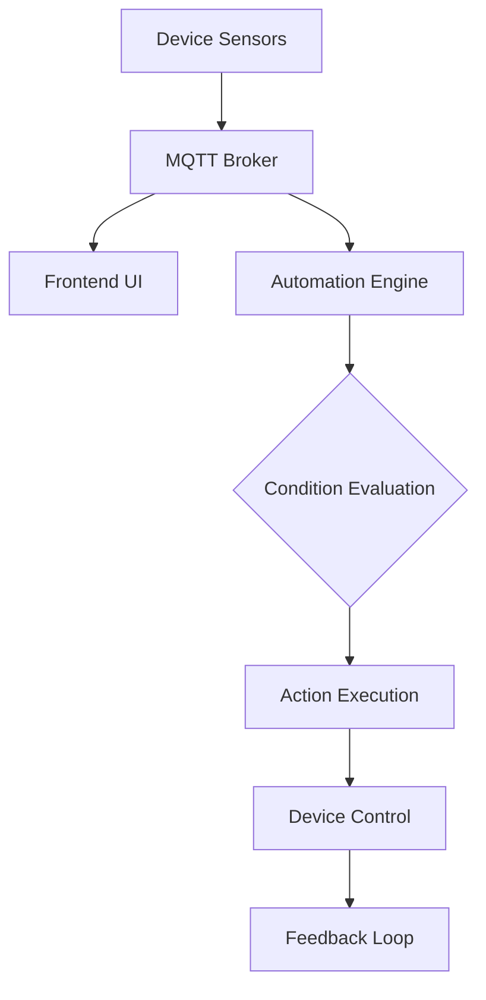
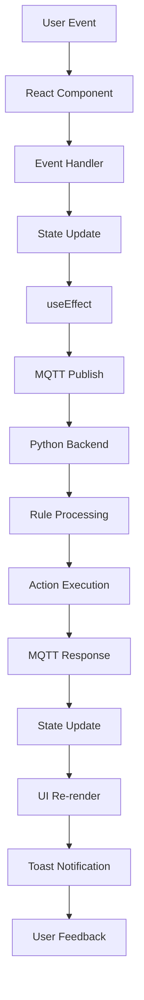

# 🔧 PALM-UI2 Automation System Documentation

## Overview

The PALM-UI2 automation system provides a comprehensive framework for automated device control and monitoring. The system consists of three primary automation types: **Logic-based**, **Time-based (Schedule)**, and **Voice-based** automation, each designed to handle different automation scenarios in industrial IoT environments.

## 🏗️ Architecture

### Automation Components

```
Frontend (Next.js/TypeScript)
├── Logic Automation (/app/control/logic/)
├── Schedule Automation (/app/control/schedule/)
├── Voice Automation (/app/control/voice/)
├── Manual Control (/app/control/manual/)
└── Unified Dashboard (/app/control/unified/)

Middleware (Python Services)
├── AutomationLogic.py     - Logic-based automation engine
├── AutomationSchedule.py  - Time-based automation service
└── AutomationVoice.py     - Voice command processing
```

### Data Flow



## 🎯 Unified Automation Dashboard

### Overview
The Unified Automation Dashboard (`/app/control/unified/`) provides a centralized interface that combines and manages all automation types (Logic, Schedule, and Voice) in a single, cohesive view. This dashboard offers system administrators and operators a bird's-eye view of all automation activities.

### Features
- **Centralized Control**: Single interface for all automation types
- **Real-time Monitoring**: Live status of all automation rules
- **Cross-automation Insights**: Performance metrics and system health
- **Bulk Operations**: Manage multiple rules simultaneously
- **Automation Analytics**: Usage statistics and performance tracking
- **Conflict Detection**: Identify and resolve automation rule conflicts

### Dashboard Components

```typescript
interface UnifiedAutomationDashboard {
  // Active automation summary
  summary: AutomationSummary;

  // Real-time rule status
  activeRules: ActiveRuleStatus[];

  // System performance metrics
  systemMetrics: SystemMetrics;

  // Conflict warnings
  conflicts: AutomationConflict[];

  // Recent activity log
  recentActivity: ActivityLog[];
}
```

### Integration Features
- **Rule Dependencies**: Visual representation of rule relationships
- **Execution Timeline**: Time-based view of automation activities
- **Resource Utilization**: Monitor device and system resource usage
- **Automated Suggestions**: AI-powered optimization recommendations
- **Backup & Restore**: Unified configuration management

---

## 🎯 Automation Types

### 1. Logic-Based Automation

#### Overview
Logic-based automation allows creation of complex rules based on device conditions and sensor values. Supports multiple trigger conditions with AND/OR logic operators.

#### Features
- **Multi-condition triggers** with logical operators
- **Trigger groups** for complex rule structures
- **Delay timers** for action timing control
- **Latching behavior** for state persistence
- **Multi-action support** (relay + messaging)
- **WhatsApp integration** for notifications

#### Rule Structure

```typescript
interface AutomationLogicRule {
  id: string;
  rule_name: string;
  description: string;
  group_rule_name: string;
  created_at: string;
  updated_at: string;
  trigger_groups: TriggerGroup[];
  actions: ControlAction[];
}

interface TriggerGroup {
  group_name: string;
  triggers: TriggerCondition[];
  group_operator: "AND" | "OR";
}

interface TriggerCondition {
  device_name: string;
  device_address: number;
  device_bus: number;
  device_topic: string;
  trigger_type: "drycontact";
  pin_number: number;
  condition_operator: "is" | "and" | "or";
  target_value: boolean;
}

interface ControlAction {
  action_type: "control_relay" | "send_message";
  target_device?: string;
  target_mac?: string;
  target_address?: number;
  target_bus?: number;
  relay_pin?: number;
  target_value?: boolean;
  message?: string;
  whatsapp_number?: string;
  delay_on?: number;  // seconds
  delay_off?: number; // seconds
  latching?: boolean;
}
```

#### Supported Devices
- **Dry Contact Sensors**: For trigger conditions
- **Relay Modules**: RELAY, RELAYMINI (6-8 channels)
- **Communication**: WhatsApp messaging via API

#### Rule Examples

**Example 1: Temperature Control**
```json
{
  "rule_name": "HVAC Temperature Control",
  "description": "Control cooling system when temperature exceeds threshold",
  "trigger_groups": [
    {
      "group_name": "Temperature Triggers",
      "group_operator": "AND",
      "triggers": [
        {
          "device_name": "TEMP_SENSOR_1",
          "pin_number": 1,
          "condition_operator": "is",
          "target_value": true
        }
      ]
    }
  ],
  "actions": [
    {
      "action_type": "control_relay",
      "target_device": "COOLING_FAN",
      "relay_pin": 1,
      "target_value": true,
      "delay_on": 5,
      "latching": false
    }
  ]
}
```

**Example 2: Multi-condition Security System**
```json
{
  "rule_name": "Office Security Alert",
  "description": "Trigger alarm when multiple conditions are met",
  "trigger_groups": [
    {
      "group_name": "Security Conditions",
      "group_operator": "AND",
      "triggers": [
        {
          "device_name": "DOOR_SENSOR",
          "pin_number": 1,
          "condition_operator": "is",
          "target_value": true
        },
        {
          "device_name": "MOTION_SENSOR",
          "pin_number": 1,
          "condition_operator": "is",
          "target_value": true
        }
      ]
    }
  ],
  "actions": [
    {
      "action_type": "control_relay",
      "target_device": "ALARM_SYSTEM",
      "relay_pin": 1,
      "target_value": true
    },
    {
      "action_type": "send_message",
      "message": "Security alert triggered in office area",
      "whatsapp_number": "6281284842478"
    }
  ]
}
```

#### Creating Logic Rules

1. **Access Logic Control**: Navigate to `/control/logic`
2. **Create New Rule**: Click "Add Logic Rule" button
3. **Configure Basic Info**: Rule name, description, group name
4. **Add Trigger Groups**: Define condition groups with AND/OR logic
5. **Configure Triggers**: Select devices, pins, conditions
6. **Add Actions**: Configure relay control and/or messaging
7. **Save Rule**: Submit to create the automation rule

### 2. Time-Based (Schedule) Automation

#### Overview
Schedule automation enables time-based device control with cron-like scheduling capabilities. Supports daily, weekly, and one-time schedules.

#### Features
- **Flexible Scheduling**: Daily, weekly, one-time options
- **Time Precision**: 15-minute intervals for time selection
- **Multi-pin Control**: Control multiple pins per device schedule
- **Device Filtering**: Relay-only device selection
- **MAC Auto-detection**: Automatic hardware address resolution

#### Schedule Configuration

```typescript
interface DeviceSchedule {
  id: string;
  customName: string;
  deviceName: string;
  name: string;
  mac: string;
  address: number;
  device_bus: number;
  part_number: string;
  startDay: string;  // "Mon", "Tue", etc.
  endDay: string;    // "Fri", "Sat", etc.
  controls: DeviceControl[];
  created_at: string;
  updated_at: string;
}

interface DeviceControl {
  pin: number;
  customName: string;
  onTime: string;    // "HH:MM" format
  offTime: string;   // "HH:MM" format
}
```

#### Schedule Types

| Type | Description | Use Case |
|------|-------------|----------|
| **Daily** | Runs every day at specified times | Regular daily operations |
| **Weekly** | Runs on selected days of the week | Workday vs weekend schedules |
| **Once** | Single execution on specific date/time | One-time events |

#### Schedule Examples

**Example 1: Office Lighting Schedule**
```json
{
  "customName": "Main Office Lights",
  "deviceName": "RELAY_OFFICE",
  "startDay": "Mon",
  "endDay": "Fri",
  "controls": [
    {
      "pin": 1,
      "customName": "Main Lights",
      "onTime": "08:00",
      "offTime": "18:00"
    },
    {
      "pin": 2,
      "customName": "Lobby Lights",
      "onTime": "07:30",
      "offTime": "19:00"
    }
  ]
}
```

**Example 2: Weekly Ventilation Schedule**
```json
{
  "customName": "Factory Ventilation",
  "deviceName": "RELAY_VENTILATION",
  "startDay": "Mon",
  "endDay": "Sat",
  "controls": [
    {
      "pin": 1,
      "customName": "Exhaust Fans",
      "onTime": "06:00",
      "offTime": "22:00"
    }
  ]
}
```

#### Creating Schedules

1. **Access Schedule Control**: Navigate to `/control/schedule`
2. **Add Device Schedule**: Click "Add Device" button
3. **Select Relay Device**: Choose from available relay devices
4. **Configure Schedule**: Set start/end days, time ranges
5. **Add Pin Controls**: Configure individual pin timing
6. **Save Schedule**: Create the time-based automation

### 3. Voice-Based Automation

#### Overview
Voice automation enables device control through speech recognition, supporting Indonesian language commands for natural interaction.

#### Features
- **Indonesian Language Support**: Local language voice recognition
- **Web Speech API Integration**: Browser-based speech recognition
- **Command Pattern Matching**: Flexible phrase recognition
- **Real-time Feedback**: Visual and audio response
- **Device Mapping**: Voice commands to device actions

#### Voice Command Structure

```typescript
interface VoiceControl {
  id: string;
  description: string;
  rule_name: string;
  device_name: string;
  part_number: string;
  pin: number;
  address: number;
  device_bus: number;
  mac: string;
  created_at: string;
  updated_at: string;
}
```

#### Supported Commands

| Indonesian | English | Action |
|------------|---------|---------|
| `nyalakan [device]` | turn on [device] | Set relay ON |
| `hidupkan [device]` | turn on [device] | Set relay ON |
| `matikan [device]` | turn off [device] | Set relay OFF |
| `mati [device]` | turn off [device] | Set relay OFF |

#### Voice Command Examples

**Device Voice Commands Setup:**
```json
[
  {
    "rule_name": "Main Lamp",
    "device_name": "RELAY_ROOM_1",
    "pin": 1,
    "description": "Main room lighting control"
  },
  {
    "rule_name": "AC Ruangan",
    "device_name": "RELAY_ROOM_2",
    "pin": 2,
    "description": "Air conditioning control"
  }
]
```

**Voice Usage:**
- Say: `"Nyalakan lampu utama"` → Turns on main lamp
- Say: `"Matikan AC ruangan"` → Turns off room AC
- Say: `"Hidupkan lampu utama"` → Turns on main lamp

#### Setting Up Voice Control

1. **Access Voice Control**: Navigate to `/control/voice`
2. **Configure Commands**: Add voice command mappings
3. **Select Devices**: Choose relay devices and pins
4. **Test Commands**: Use voice recognition to test
5. **Save Configuration**: Store voice automation setup

---

## 🎨 Frontend Architecture & Implementation

### Overview
The frontend automation system is built using **Next.js 14** with **TypeScript**, **Tailwind CSS**, and **Radix UI** components, providing a modern, responsive, and accessible user interface for industrial automation management.

### Core Architecture Components

#### 1. **Page Structure (`/app/control/`)**

```
app/control/
├── logic/page.tsx      # Logic automation interface (2800+ lines)
├── schedule/page.tsx   # Schedule automation interface (2000+ lines)
├── voice/page.tsx      # Voice automation interface (1500+ lines)
├── manual/page.tsx     # Direct device control interface
└── unified/page.tsx    # Unified automation dashboard
```

#### 2. **Reusable Components (`/components/control/`)**

```typescript
components/control/
├── ControlSummaryCard.tsx      # Dashboard summary cards with metrics
├── ControlHeader.tsx           # Page headers with status indicators
├── ControlDialog.tsx           # Modal dialogs for CRUD operations
├── ControlTable.tsx            # Data tables with sorting/pagination
└── ControlFormField.tsx        # Form field components (Input, Select, etc.)
```

#### 3. **Core Libraries (`/lib/`)**

```typescript
lib/
├── mqttClient.ts          # MQTT WebSocket client implementation
├── toast-utils.ts         # Toast notification system
├── api-service.ts         # REST API communication layer
└── utils.ts               # Common utility functions
```

### State Management Architecture

#### React Context + Custom Hooks Pattern

```typescript
// Global MQTT Context
const MQTTContext = createContext<MQTTContextType>({
  isConnected: false,
  connectionStatus: 'disconnected',
  publish: (topic: string, message: any) => {},
  subscribe: (topic: string) => {},
  unsubscribe: (topic: string) => {},
  client: null
});

// Custom Hooks for Automation Data
const useAutomationRules = () => {
  const [rules, setRules] = useState<AutomationRule[]>([]);
  const [loading, setLoading] = useState(false);
  const [error, setError] = useState<string | null>(null);

  const createRule = useCallback(async (ruleData: Partial<AutomationRule>) => {
    setLoading(true);
    try {
      const mqttClient = getMQTTClient();
      const payload = { action: 'add', data: ruleData };
      mqttClient.publish('command_control_logic', JSON.stringify(payload));
      showToast.success('Rule created successfully');
    } catch (error) {
      setError(error.message);
      showToast.error('Failed to create rule');
    } finally {
      setLoading(false);
    }
  }, []);

  return {
    rules,
    loading,
    error,
    createRule,
    updateRule: useCallback(async (id: string, updates: Partial<AutomationRule>) => {
      // Update implementation
    }, []),
    deleteRule: useCallback(async (id: string) => {
      // Delete implementation
    }, []),
    refreshRules: useCallback(() => {
      // Refresh implementation
    }, [])
  };
};
```

### Data Flow Architecture

#### Reactive Data Flow



#### Real-time Updates Pattern

```typescript
// Real-time device status tracking
const useDeviceStatus = () => {
  const [devices, setDevices] = useState<Device[]>([]);
  const [onlineDevices, setOnlineDevices] = useState<Set<string>>(new Set());

  useEffect(() => {
    // Subscribe to device status topics
    const client = getMQTTClient();
    client.subscribe('device/+/status');
    client.subscribe('device/+/data');

    client.on('message', (topic: string, message: Buffer) => {
      const payload = JSON.parse(message.toString());

      if (topic.includes('/status')) {
        const deviceId = topic.split('/')[1];
        const isOnline = payload.online;
        setOnlineDevices(prev => {
          const newSet = new Set(prev);
          if (isOnline) {
            newSet.add(deviceId);
          } else {
            newSet.delete(deviceId);
          }
          return newSet;
        });
      }
    });

    return () => {
      client.unsubscribe('device/+/status');
      client.unsubscribe('device/+/data');
    };
  }, []);

  return { devices, onlineDevices };
};
```

### MQTT Integration Layer

#### Connection Management

```typescript
export class MQTTManager {
  private client: MqttClient | null = null;
  private reconnectTimeout: NodeJS.Timeout | null = null;
  private connectionState: 'disconnected' | 'connecting' | 'connected' | 'error' = 'disconnected';
  private retryCount = 0;
  private maxRetries = 5;

  constructor(
    private brokerUrl: string,
    private options: {
      username?: string;
      password?: string;
      clientId?: string;
    } = {}
  ) {}

  async connect(): Promise<void> {
    return new Promise((resolve, reject) => {
      try {
        this.client = mqtt.connect(this.brokerUrl, {
          ...this.options,
          reconnectPeriod: 5000,
          connectTimeout: 30000,
          clean: true,
          keepalive: 60
        });

        this.client.on('connect', () => {
          this.connectionState = 'connected';
          this.retryCount = 0;
          console.log('[MQTT] Connected successfully');

          // Subscribe to core topics
          this.subscribeToSystemTopics();

          resolve();
        });

        this.client.on('error', (error) => {
          this.connectionState = 'error';
          console.error('[MQTT] Connection error:', error);

          if (this.retryCount < this.maxRetries) {
            this.scheduleReconnect();
          } else {
            reject(error);
          }
        });

        this.client.on('offline', () => {
          this.connectionState = 'disconnected';
          this.scheduleReconnect();
        });

        this.client.on('reconnect', () => {
          this.connectionState = 'connecting';
          this.retryCount++;
        });

      } catch (error) {
        reject(error);
      }
    });
  }

  private subscribeToSystemTopics(): void {
    if (!this.client?.connected()) return;

    const topics = [
      'response_control_logic',
      'response_control_scheduler',
      'response_control_voice',
      'MODULAR_DEVICE/AVAILABLES',
      'system/error/log'
    ];

    topics.forEach(topic => {
      this.client?.subscribe(topic, { qos: 1 }, (err) => {
        if (err) {
          console.error(`[MQTT] Failed to subscribe to ${topic}:`, err);
        }
      });
    });
  }

  private scheduleReconnect(): void {
    if (this.reconnectTimeout) return;

    const delay = Math.min(1000 * Math.pow(2, this.retryCount), 30000);

    this.reconnectTimeout = setTimeout(() => {
      this.reconnectTimeout = null;
      this.connect();
    }, delay);
  }

  publish(topic: string, message: any, options: mqtt.IClientPublishOptions = { qos: 1, retain: false }): Promise<void> {
    return new Promise((resolve, reject) => {
      if (!this.client?.connected()) {
        reject(new Error('MQTT client not connected'));
        return;
      }

      const payload = typeof message === 'string' ? message : JSON.stringify(message);

      this.client.publish(topic, payload, options, (error) => {
        if (error) {
          reject(error);
        } else {
          resolve();
        }
      });
    });
  }

  disconnect(): void {
    if (this.reconnectTimeout) {
      clearTimeout(this.reconnectTimeout);
      this.reconnectTimeout = null;
    }

    if (this.client) {
      this.client.end(true);
      this.client = null;
    }

    this.connectionState = 'disconnected';
  }

  getConnectionState(): string {
    return this.connectionState;
  }

  isConnected(): boolean {
    return this.connectionState === 'connected' && this.client?.connected() === true;
  }
}

// Global MQTT instance
let mqttManager: MQTTManager | null = null;

export const getMQTTManager = (): MQTTManager => {
  if (!mqttManager) {
    const brokerUrl = process.env.NEXT_PUBLIC_MQTT_BROKER || 'ws://localhost:8083/mqtt';
    mqttManager = new MQTTManager(brokerUrl, {
      username: process.env.NEXT_PUBLIC_MQTT_USERNAME,
      password: process.env.NEXT_PUBLIC_MQTT_PASSWORD,
      clientId: `palmui2-frontend-${Date.now()}`
    });
  }
  return mqttManager;
};
```

### UI Components & User Experience

#### Modal Dialog System

```typescript
// Reusable automation rule creation dialog
interface AutomationRuleDialogProps {
  isOpen: boolean;
  onClose: () => void;
  initialData?: Partial<AutomationRule>;
  onSubmit: (data: AutomationRule) => Promise<void>;
  type: 'logic' | 'schedule' | 'voice';
}

const AutomationRuleDialog: React.FC<AutomationRuleDialogProps> = ({
  isOpen,
  onClose,
  initialData,
  onSubmit,
  type
}) => {
  const [formData, setFormData] = useState<Partial<AutomationRule>>(initialData || {});
  const [loading, setLoading] = useState(false);
  const [validationErrors, setValidationErrors] = useState<Record<string, string>>({});

  const handleSubmit = async (e: React.FormEvent) => {
    e.preventDefault();
    setLoading(true);

    try {
      // Validation based on type
      const errors = validateAutomationRule(formData, type);
      if (Object.keys(errors).length > 0) {
        setValidationErrors(errors);
        return;
      }

      await onSubmit(formData as AutomationRule);
      onClose();
      setFormData({});
      setValidationErrors({});
    } catch (error) {
      showToast.error('Failed to save automation rule');
    } finally {
      setLoading(false);
    }
  };

  return (
    <Dialog open={isOpen} onOpenChange={onClose}>
      <DialogContent className="max-w-4xl max-h-[90vh] overflow-y-auto">
        <DialogHeader>
          <DialogTitle>
            {type === 'logic' ? 'Logic Automation Rule' :
             type === 'schedule' ? 'Schedule Automation Rule' :
             'Voice Automation Rule'}
          </DialogTitle>
        </DialogHeader>

        <form onSubmit={handleSubmit} className="space-y-6">
          {/* Dynamic form fields based on automation type */}
          {type === 'logic' && <LogicRuleForm formData={formData} setFormData={setFormData} />}
          {type === 'schedule' && <ScheduleRuleForm formData={formData} setFormData={setFormData} />}
          {type === 'voice' && <VoiceRuleForm formData={formData} setFormData={setFormData} />}

          {/* Validation Errors */}
          {Object.keys(validationErrors).length > 0 && (
            <Alert variant="destructive">
              <AlertTitle>Validation Errors</AlertTitle>
              <AlertDescription>
                <ul className="list-disc list-inside">
                  {Object.entries(validationErrors).map(([field, message]) => (
                    <li key={field}>{message}</li>
                  ))}
                </ul>
              </AlertDescription>
            </Alert>
          )}

          <DialogFooter>
            <Button type="button" variant="outline" onClick={onClose}>
              Cancel
            </Button>
            <Button type="submit" disabled={loading}>
              {loading ? <Loader2 className="animate-spin h-4 w-4" /> : 'Save Rule'}
            </Button>
          </DialogFooter>
        </form>
      </DialogContent>
    </Dialog>
  );
};
```

#### Data Tables with Advanced Features

```typescript
// Advanced automation rules table
interface AutomationTableProps<T> {
  data: T[];
  columns: TableColumn<T>[];
  loading?: boolean;
  onEdit?: (item: T) => void;
  onDelete?: (item: T) => void;
  onView?: (item: T) => void;
  pagination?: {
    currentPage: number;
    totalPages: number;
    onPageChange: (page: number) => void;
  };
  sorting?: {
    sortBy: string;
    sortOrder: 'asc' | 'desc';
    onSort: (sortBy: string) => void;
  };
  filtering?: {
    filters: Record<string, any>;
    onFilter: (filters: Record<string, any>) => void;
  };
}

const AutomationTable = <T extends { id: string }>({
  data,
  columns,
  loading,
  onEdit,
  onDelete,
  onView,
  pagination,
  sorting,
  filtering
}: AutomationTableProps<T>) => {
  const [selectedRows, setSelectedRows] = useState<Set<string>>(new Set());

  const handleSelectAll = (checked: boolean) => {
    if (checked) {
      setSelectedRows(new Set(data.map(item => item.id)));
    } else {
      setSelectedRows(new Set());
    }
  };

  const handleSelectRow = (id: string, checked: boolean) => {
    setSelectedRows(prev => {
      const newSet = new Set(prev);
      if (checked) {
        newSet.add(id);
      } else {
        newSet.delete(id);
      }
      return newSet;
    });
  };

  return (
    <div className="rounded-lg border bg-background shadow-sm">
      {/* Table Actions Bar */}
      <div className="p-4 border-b">
        <div className="flex items-center justify-between">
          <div className="flex items-center space-x-4">
            {selectedRows.size > 0 && (
              <>
                <span className="text-sm text-muted-foreground">
                  {selectedRows.size} selected
                </span>
                <Button variant="outline" size="sm">
                  Bulk Edit
                </Button>
                <Button variant="outline" size="sm" className="text-destructive">
                  Bulk Delete
                </Button>
              </>
            )}
          </div>

          {/* Search and Filters */}
          <div className="flex items-center space-x-2">
            <Input placeholder="Search..." className="w-64" />
            <Button variant="outline" size="sm">
              <Filter className="h-4 w-4" />
            </Button>
          </div>
        </div>
      </div>

      <div className="overflow-x-auto">
        <table className="w-full">
          <thead>
            <tr className="border-b bg-muted/50">
              <th className="p-4">
                <Checkbox
                  checked={selectedRows.size === data.length && data.length > 0}
                  onCheckedChange={handleSelectAll}
                />
              </th>
              {columns.map(column => (
                <th
                  key={column.key}
                  className="p-4 text-left font-medium cursor-pointer hover:bg-muted/70"
                  onClick={() => sorting?.onSort(column.key)}
                >
                  <div className="flex items-center space-x-1">
                    <span>{column.label}</span>
                    {sorting?.sortBy === column.key && (
                      <ArrowUpDown className={`h-4 w-4 ${
                        sorting.sortOrder === 'desc' ? 'rotate-180' : ''
                      }`} />
                    )}
                  </div>
                </th>
              ))}
              <th className="p-4 text-center font-medium">Actions</th>
            </tr>
          </thead>
          <tbody>
            {loading ? (
              <tr>
                <td colSpan={columns.length + 2} className="p-8 text-center">
                  <Loader2 className="animate-spin h-6 w-6 mx-auto mb-2" />
                  Loading...
                </td>
              </tr>
            ) : data.length === 0 ? (
              <tr>
                <td colSpan={columns.length + 2} className="p-8 text-center">
                  <p className="text-muted-foreground">No automation rules found</p>
                </td>
              </tr>
            ) : (
              data.map(item => (
                <tr key={item.id} className="border-b hover:bg-muted/30">
                  <td className="p-4">
                    <Checkbox
                      checked={selectedRows.has(item.id)}
                      onCheckedChange={(checked) => handleSelectRow(item.id, !!checked)}
                    />
                  </td>
                  {columns.map(column => (
                    <td key={column.key} className="p-4">
                      {column.render ? column.render(item) : (item as any)[column.key]}
                    </td>
                  ))}
                  <td className="p-4">
                    <div className="flex items-center justify-center space-x-2">
                      {onView && (
                        <Button variant="ghost" size="sm" onClick={() => onView(item)}>
                          <Eye className="h-4 w-4" />
                        </Button>
                      )}
                      {onEdit && (
                        <Button variant="ghost" size="sm" onClick={() => onEdit(item)}>
                          <Edit2 className="h-4 w-4" />
                        </Button>
                      )}
                      {onDelete && (
                        <Button variant="ghost" size="sm" onClick={() => onDelete(item)}>
                          <Trash2 className="h-4 w-4" />
                        </Button>
                      )}
                    </div>
                  </td>
                </tr>
              ))
            )}
          </tbody>
        </table>
      </div>

      {/* Pagination */}
      {pagination && (
        <div className="p-4 border-t">
          <div className="flex items-center justify-between">
            <p className="text-sm text-muted-foreground">
              Showing {(pagination.currentPage - 1) * 10 + 1} to {Math.min(pagination.currentPage * 10, data.length)} of {data.length} results
            </p>
            <div className="flex items-center space-x-2">
              <Button
                variant="outline"
                size="sm"
                disabled={pagination.currentPage === 1}
                onClick={() => pagination.onPageChange(pagination.currentPage - 1)}
              >
                Previous
              </Button>
              <span className="text-sm">
                Page {pagination.currentPage} of {pagination.totalPages}
              </span>
              <Button
                variant="outline"
                size="sm"
                disabled={pagination.currentPage === pagination.totalPages}
                onClick={() => pagination.onPageChange(pagination.currentPage + 1)}
              >
                Next
              </Button>
            </div>
          </div>
        </div>
      )}
    </div>
  );
};
```

### Error Handling & User Feedback

#### Toast Notification System

```typescript
// Toast utilities for consistent user feedback
export const showToast = {
  success: (message: string, description?: string) => {
    toast.success(message, {
      description,
      duration: 4000,
    });
  },

  error: (message: string, description?: string) => {
    toast.error(message, {
      description,
      duration: 6000,
    });
  },

  warning: (message: string, description?: string) => {
    toast.warning(message, {
      description,
      duration: 5000,
    });
  },

  info: (message: string, description?: string) => {
    toast.info(message, {
      description,
      duration: 4000,
    });
  }
};

// Global error boundary for automation pages
class AutomationErrorBoundary extends Component<
  { children: ReactNode },
  { hasError: boolean; error?: Error }
> {
  constructor(props: { children: ReactNode }) {
    super(props);
    this.state = { hasError: false };
  }

  static getDerivedStateFromError(error: Error) {
    return { hasError: true, error };
  }

  componentDidCatch(error: Error, errorInfo: ErrorInfo) {
    // Log to error reporting service
    console.error('Automation Error Boundary:', error, errorInfo);
    showToast.error('Application Error', 'An unexpected error occurred');
  }

  render() {
    if (this.state.hasError) {
      return (
        <div className="p-6 text-center">
          <AlertTriangle className="h-12 w-12 mx-auto mb-4 text-destructive" />
          <h3 className="text-lg font-semibold mb-2">Something went wrong</h3>
          <p className="text-muted-foreground mb-4">
            The automation system encountered an error. Please try refreshing the page.
          </p>
          <Button onClick={() => window.location.reload()}>
            Refresh Page
          </Button>
        </div>
      );
    }

    return this.props.children;
  }
}
```

### Performance Optimizations

#### React Optimization Techniques

```typescript
// Memoized automation rule component
const AutomationRuleCard = memo<AutomationRuleCardProps>(({ rule, onEdit, onDelete }) => {
  const statusColor = useMemo(() => {
    // Compute status color based on rule state
    return rule.enabled ? 'text-green-600' : 'text-gray-400';
  }, [rule.enabled]);

  const lastExecutedDisplay = useMemo(() => {
    if (!rule.lastExecuted) return 'Never';
    return new Date(rule.lastExecuted).toLocaleString();
  }, [rule.lastExecuted]);

  return (
    <Card className="hover:shadow-md transition-shadow">
      <CardContent className="p-4">
        <div className="flex items-center justify-between">
          <div className="flex-1">
            <h3 className="font-semibold">{rule.name}</h3>
            <p className="text-sm text-muted-foreground">{rule.description}</p>
            <div className="flex items-center mt-2 space-x-4 text-xs text-muted-foreground">
              <span>Last executed: {lastExecutedDisplay}</span>
              <span className={`inline-flex items-center ${statusColor}`}>
                <div className={`w-2 h-2 rounded-full mr-1 ${
                  rule.enabled ? 'bg-green-500' : 'bg-gray-400'
                }`} />
                {rule.enabled ? 'Active' : 'Disabled'}
              </span>
            </div>
          </div>
          <div className="flex items-center space-x-2">
            <Button variant="ghost" size="sm" onClick={() => onEdit(rule)}>
              <Edit2 className="h-4 w-4" />
            </Button>
            <Button variant="ghost" size="sm" onClick={() => onDelete(rule.id)}>
              <Trash2 className="h-4 w-4" />
            </Button>
          </div>
        </div>
      </CardContent>
    </Card>
  );
});

// Virtualization for large automation rule lists
const VirtualizedAutomationList = ({ rules }: { rules: AutomationRule[] }) => {
  const parentRef = useRef<HTMLDivElement>(null);
  const rowVirtualizer = useVirtualizer({
    count: rules.length,
    getScrollElement: () => parentRef.current,
    estimateSize: () => 80,
  });

  return (
    <div ref={parentRef} className="h-96 overflow-auto">
      <div
        style={{
          height: `${rowVirtualizer.getTotalSize()}px`,
        }}
        className="relative w-full"
      >
        {rowVirtualizer.getVirtualItems().map((virtualItem) => (
          <div
            key={virtualItem.key}
            style={{
              position: 'absolute',
              top: 0,
              left: 0,
              width: '100%',
              height: `${virtualItem.size}px`,
              transform: `translateY(${virtualItem.start}px)`,
            }}
          >
            <AutomationRuleCard rule={rules[virtualItem.index]} />
          </div>
        ))}
      </div>
    </div>
  );
};
```

### Responsive Design & Mobile Support

#### Mobile-First Responsive Components

```typescript
// Responsive automation summary cards
const ResponsiveAutomationCards = () => {
  return (
    <div className="grid grid-cols-1 sm:grid-cols-2 lg:grid-cols-4 gap-4">
      <Card className="shadow-sm hover:shadow-md transition-shadow">
        <CardHeader className="flex flex-row items-center justify-between space-y-0 pb-2">
          <CardTitle className="text-sm font-medium">Logic Rules</CardTitle>
          <Brain className="h-5 w-5 text-blue-600" />
        </CardHeader>
        <CardContent>
          <div className="text-2xl font-bold">12</div>
          <p className="text-xs text-muted-foreground">
            Active automation rules
          </p>
        </CardContent>
      </Card>

      {/* Additional metric cards */}
    </div>
  );
};

// Mobile-optimized table with horizontal scroll
const MobileOptimizedTable = () => {
  return (
    <div className="block md:hidden">
      {/* Mobile card layout */}
      <div className="space-y-4">
        {rules.map(rule => (
          <Card key={rule.id} className="p-4">
            <div className="flex justify-between items-start">
              <div className="flex-1">
                <h3 className="font-semibold">{rule.name}</h3>
                <p className="text-sm text-muted-foreground">{rule.description}</p>
              </div>
              <div className="flex space-x-2">
                <Button size="sm" variant="outline">
                  <Edit2 className="h-4 w-4" />
                </Button>
              </div>
            </div>
            <div className="mt-4 grid grid-cols-2 gap-4 text-sm">
              <div>
                <span className="text-muted-foreground">Status:</span>
                <Badge variant="outline" className="ml-2">
                  {rule.enabled ? 'Active' : 'Inactive'}
                </Badge>
              </div>
              <div>
                <span className="text-muted-foreground">Type:</span>
                <span className="ml-2 capitalize">{rule.type}</span>
              </div>
            </div>
          </Card>
        ))}
      </div>
    </div>
  );
};
```

### Accessibility Features

#### ARIA Support for Automation Controls

```typescript
// Accessible automation rule form
const AccessibleAutomationForm = () => {
  return (
    <form role="form" aria-labelledby="automation-form-title">
      <h2 id="automation-form-title" className="sr-only">
        Create Automation Rule
      </h2>

      <div className="space-y-6">
        <div>
          <Label htmlFor="rule-name" className="text-sm font-medium">
            Rule Name
          </Label>
          <Input
            id="rule-name"
            aria-describedby="rule-name-help"
            aria-required="true"
            type="text"
            placeholder="Enter rule name"
          />
          <p id="rule-name-help" className="sr-only">
            Provide a descriptive name for your automation rule
          </p>
        </div>

        {/* Form fields with proper ARIA labels */}
      </div>

      <div className="flex justify-end space-x-4">
        <Button type="button" variant="outline">
          Cancel
        </Button>
        <Button
          type="submit"
          disabled={loading}
          aria-describedby="submit-button-status"
        >
          {loading ? (
            <>
              <Loader2 className="animate-spin h-4 w-4 mr-2" aria-hidden="true" />
              Creating Rule...
            </>
          ) : (
            'Create Rule'
          )}
        </Button>
      </div>

      {/* Status announcements for screen readers */}
      <div id="submit-button-status" className="sr-only" aria-live="polite">
        {loading ? 'Creating automation rule, please wait' : ''}
      </div>
    </form>
  );
};
```

---

## 🔧 Backend Automation Engine

## 🔧 Backend Automation Engine

### AutomationLogic.py Service

The core automation engine that processes logic rules and executes actions.

#### Key Components

**MQTT Clients:**
- `client_crud`: Handles configuration operations (CRUD)
- `client_control`: Manages device control and monitoring

**Core Functions:**
- `process_modular_device_data()`: Process incoming device data
- `evaluate_rule()`: Evaluate automation rule conditions
- `execute_rule_actions()`: Execute rule actions with timing
- `handle_crud_request()`: Process configuration changes

#### Rule Processing Flow

```python
# 1. Receive device data via MQTT
def process_modular_device_data(device_data):
    device_name = device_data.get('device_name')
    data = device_data.get('data')

    # 2. Update device state
    device_states[device_name] = data

    # 3. Evaluate all rules for this device
    for rule in config:
        evaluate_rule(rule, device_name, data)

# 4. Evaluate rule conditions
def evaluate_rule(rule, device_name, device_data):
    for group in rule['trigger_groups']:
        group_result = evaluate_trigger_group(group, device_name, device_data)

        if all_groups_true and not previous_state:
            execute_rule_actions(rule)  # ON actions
        elif not all_groups_true and previous_state:
            execute_rule_actions_off(rule)  # OFF actions
```

### MQTT Communication Topics

#### Control Topics
```mqtt
# Logic Automation
command_control_logic    # Send commands to logic engine
response_control_logic   # Receive responses from logic engine

# Device Control
modular                  # Direct device control commands
MODULAR_DEVICE/AVAILABLES # Available device information

# Messaging
result/message/logic/control # Action result messages
```

#### Command Formats

**Logic Rule Commands:**
```json
{
  "action": "add|set|delete|get",
  "data": { /* rule configuration */ }
}
```

**Device Control Commands:**
```json
{
  "mac": "hardware_address",
  "protocol_type": "Modular",
  "device": "RELAYMINI|RELAY",
  "function": "write",
  "value": {
    "pin": 1,
    "data": 1
  }
}
```

## 📊 Monitoring & Troubleshooting

### Automation Logs

#### Log Types
- **Rule Execution**: When rules are triggered
- **Action Results**: Success/failure of actions
- **Error Logs**: System errors and warnings
- **Device Status**: Online/offline status changes

#### Log Structure
```
[INFO] Logic rule triggered (ON): Temperature Control
[SUCCESS] Relay control sent: COOLING_FAN pin 1 = True
[ERROR] Failed to send WhatsApp message: API timeout
```

### Common Issues

#### Logic Automation Issues
- **Rule not triggering**: Check trigger conditions and device data
- **Action delays**: Verify delay timer configurations
- **MQTT disconnections**: Check broker connectivity
- **Device not responding**: Validate device configuration

#### Schedule Automation Issues
- **Time not triggering**: Check system time and timezone
- **Device offline**: Verify device connection
- **Schedule conflicts**: Review overlapping schedules
- **Pin conflicts**: Check for pin usage conflicts

#### Voice Control Issues
- **Recognition failures**: Check browser permissions
- **Device mapping**: Verify voice command mappings
- **Network issues**: Ensure stable internet connection
- **Language support**: Confirm Indonesian language setting

## 🎯 Advanced Features

### Delay Timers
Both ON and OFF delay timers for sophisticated timing control:

```typescript
{
  "action": {
    "delay_on": 5,    // Wait 5 seconds before turning ON
    "delay_off": 10   // Wait 10 seconds before turning OFF
  }
}
```

### Latching Behavior
Maintain relay state when trigger conditions change:

```typescript
{
  "action": {
    "latching": true   // Keep relay ON even when trigger stops
  }
}
```

### Multi-action Rules
Execute multiple actions for complex automation scenarios.

### WhatsApp Integration
Send notifications via WhatsApp API for remote monitoring.

## 📈 Performance Optimization

### Rule Evaluation Optimization
- **Device-specific processing**: Only evaluate rules for active devices
- **State tracking**: Avoid redundant evaluations
- **Threading**: Asynchronous action execution
- **Connection pooling**: Efficient MQTT client management

### Memory Management
- **Configuration caching**: In-memory rule storage
- **Device state tracking**: Efficient state management
- **Timer cleanup**: Automatic cleanup of expired timers
- **Resource limits**: Configurable connection limits

## 🔧 Configuration & Setup

### Environment Variables
```env
# MQTT Configuration
MQTT_BROKER=localhost
MQTT_PORT=1883
MQTT_USERNAME=your_username
MQTT_PASSWORD=your_password

# WhatsApp API (Optional)
WHATSAPP_API_URL=https://service-chat.qontak.com/api/open/v1/broadcasts/whatsapp/direct
WHATSAPP_BEARER_TOKEN=your_token
WHATSAPP_TEMPLATE_ID=300d84f2-d962-4451-bc27-870fb99d18e7
```

### Service Startup

#### Linux Systemd Service
```bash
# Install automation service
sudo cp automation-logic.service /etc/systemd/system/
sudo systemctl daemon-reload
sudo systemctl enable automation-logic
sudo systemctl start automation-logic
```

#### Windows Service
```powershell
# Install as Windows service (requires NSSM or similar)
nssm install AutomationLogic "python3" "AutomationLogic.py"
nssm start AutomationLogic
```

## 🔍 Advanced Usage

### Complex Rule Logic
Combine multiple conditions with nested groups:

```json
{
  "trigger_groups": [
    {
      "group_name": "Main Conditions (AND)",
      "group_operator": "AND",
      "triggers": [
        {"device": "TEMP", "condition": ">", "value": 30},
        {"device": "HUMIDITY", "condition": "<", "value": 70}
      ]
    },
    {
      "group_name": "Backup Conditions (OR)",
      "group_operator": "OR",
      "triggers": [
        {"device": "SMOKE", "condition": "==", "value": true}
      ]
    }
  ]
}
```

### Integration with Business Logic
Connect with ERP systems, SCADA, or other industrial systems through MQTT topics and API callbacks.

---

## 📚 Additional Resources

- **[API Documentation](../docs/API.md)** - REST API reference
- **[Device Integration](../docs/DEVICES.md)** - Hardware device setup
- **[MQTT Topics](./MQTT_TOPICS.md)** - Complete topic reference
- **[Troubleshooting](../docs/TROUBLESHOOTING.md)** - Common issues and solutions

---

**For technical support or questions about the automation system, please contact the GSPE IoT development team.**
